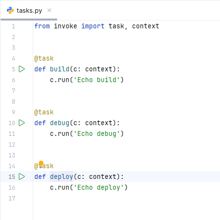
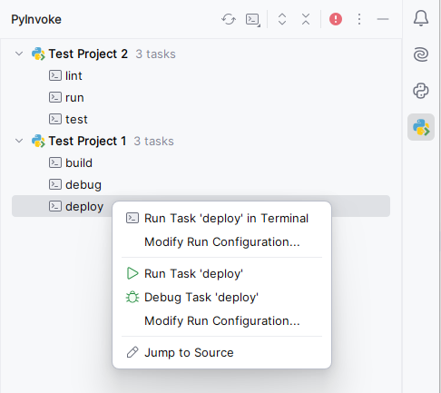

<h1 align="center">
   
  
   
  PyInvoke for IntelliJ IDEs
   
</h1>

<h4 align="center">
    Provides <a href="https://github.com/pyinvoke/invoke" target="_blank">PyInvoke</a> support to all IntelliJ-based IDEs.
</h4>

  
  
  
  <!-- todo: add when ratings exist:  -->

  <a href="#showcase">Showcase</a> •
  <a href="#description">Description</a> •
  <a href="#key-features">Key Features</a> •
  <a href="#Installation">Installation</a> •
  <a href="#license">License</a>

## Showcase

    
    

## Description
<!-- Plugin description -->
Provides **[PyInvoke](https://github.com/pyinvoke/invoke)** support to all **IntelliJ-based IDEs**.\
**Execute** and **debug** your PyInvoke tasks directly within your IDE.

## Key Features
- **▶️ Inline Run Buttons**: Easily run your PyInvoke tasks with convenient inline run buttons placed next to each task function.
- **📋 Task Overview**: Access a comprehensive overview of all available tasks in your project, allowing you to run any task with a single click.
- **⚙️ Multiple Execution Options**: Choose from three different execution methods:
    - **▶️ Terminal**: Execute tasks directly from the command line.
    - **🐍 SDK Run**: Run tasks using your project's configured Python SDK.
    - **🪲 SDK Debug**: Debug tasks seamlessly within IntelliJ.

## Upcoming Features
- **Parameter Detection**: Automatically detect possible task parameters and provide an intuitive interface for specifying these parameters within run configurations.
<!-- Plugin description end -->

## Installation
- Using the IDE built-in plugin system:\
  <kbd>Settings/Preferences</kbd> > <kbd>Plugins</kbd> > <kbd>Marketplace</kbd> > <kbd>Search for "intellij-pyinvoke"</kbd> >
  <kbd>Install</kbd>
  
- Manually:\
  Download the [latest release](https://github.com/kairaedsch/intellij-pyinvoke/releases/latest) and install it manually using
  <kbd>Settings/Preferences</kbd> > <kbd>Plugins</kbd> > <kbd>⚙️</kbd> > <kbd>Install plugin from disk...</kbd>

## License
[MIT](LICENSE)
